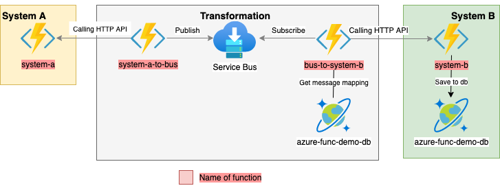

## Introduction
This simple demo shows possible integration between two systems (system A and system B) using Azure Functions.


The full example with all resources could be found [here](https://github.com/pajikos/cloud-samples/tree/master/azure-functions-system-integration) on GitHub.


The architecture constraints:
* All updates from the system A must be transfered into the system B
* The system A is listening on HTTP with REST API
* The system B is listening on HTTP with REST API
* The system B is not fully compatible in message definitions, so field mapping must be used
* The mapping must be saved in DB (I chose CosmosDB)
* Due to missing push notification in the system A, its API must be periodically checked
* The system B may be occasionally offline, so some type of persistent bus should be used.




## Deploy Azure Functions and related resources

Setup environments:
```bash
source .envrc
```

### Azure Function deployment

```bash
# Create a required storage account for application code
az storage account create --name $STORAGE_ACCOUNT_NAME --sku Standard_LRS --resource-group $RG --location $LOCATION
# Create function app
az functionapp create --consumption-plan-location $LOCATION \
--runtime python \
--runtime-version 3.8 \
--functions-version 3 \
--name $FUNC_APP_NAME \
--os-type linux \
--resource-group $RG \
--storage-account $STORAGE_ACCOUNT_NAME
```

### Deploy Azure Service Bus
```bash
# Create service bus namespace
az servicebus namespace create --resource-group $RG --name $SERVICEBUS_NAMESPACE --location $LOCATION --sku Standard

# Subscription model will be used, so create topic
az servicebus topic create --name system-a-in \
    --resource-group $RG \
    --namespace-name $SERVICEBUS_NAMESPACE

# Create a required subscription
az servicebus topic subscription create --resource-group $RG --namespace-name $SERVICEBUS_NAMESPACE --topic-name system-a-in --name system-a-in-subscription
```

### Deploy and setup Cosmos DB

```bash
az cosmosdb create \
    --name $COSMOSDB_ACCOUNT_NAME \
    --kind GlobalDocumentDB \
    --resource-group $RG
```

Create Database and Collection in the Cosmos DB:
```bash
# Get Key
COSMOSDB_KEY=$(az cosmosdb keys list --name $COSMOSDB_ACCOUNT_NAME --resource-group $RG --output tsv |awk '{print $1}')
# Create Database
az cosmosdb database create \
    --name $COSMOSDB_ACCOUNT_NAME \
    --db-name $DATABASE_NAME \
    --key $COSMOSDB_KEY \
    --resource-group $RG

# Create a container for customers (System B)
# Create a container with a partition key and provision 400 RU/s throughput.
COLLECTION_NAME="customers"
az cosmosdb collection create \
    --resource-group $RG \
    --collection-name $COLLECTION_NAME \
    --name $COSMOSDB_ACCOUNT_NAME \
    --db-name $DATABASE_NAME \
    --partition-key-path /id \
    --throughput 400

# Create a container for mapping
COLLECTION_NAME="mapping"
az cosmosdb collection create \
    --resource-group $RG \
    --collection-name $COLLECTION_NAME \
    --name $COSMOSDB_ACCOUNT_NAME \
    --db-name $DATABASE_NAME \
    --partition-key-path /id \
    --throughput 400
```

Insert the following json into `mapping` container:
```json
{
    "id": "SYSTEMB",
    "new_fields": [
        {
            "input_fields": [
                "first_name",
                "last_name"
            ],
            "separator": " ",
            "output_fields": [
                "full_name"
            ],
            "operation": "CONCAT"
        },
        {
            "input_fields": [
                "address_line2"
            ],
            "separator": "/",
            "output_fields": [
                "city",
                "postal_code"
            ],
            "operation": "SPLIT"
        }
    ],
    "delete_fields": [
        "first_name",
        "last_name"
    ]
}
```

## Deploy functions itself

```bash
func azure functionapp publish $FUNC_APP_NAME
```

Basic overview of deployed functions:

```console
Functions in skl-func-app:
    bus-to-system-b - [serviceBusTrigger]

    system-a - [httpTrigger]
        Invoke url: https://skl-func-app.azurewebsites.net/api/system-a

    system-b - [httpTrigger]
        Invoke url: https://skl-func-app.azurewebsites.net/api/system-b

    system-a-to-bus - [timerTrigger]

```
## Debugging and testing

### Running functions locally

```bash
func start
```

When all functions starts, two endpoint will be created:

```console
Functions:

	system-a: [GET,POST] http://localhost:7071/api/system-a

	system-b: [POST] http://localhost:7071/api/system-b

	bus-to-system-b: serviceBusTrigger

	system-a-to-bus: timerTrigger
```

URL `http://localhost:7071/api/system-a` simulates the REST API of the System A and `http://localhost:7071/api/system-b` simulates the REST API of the Bystem B. 

### Logs
Log stream in console is not currently supported in Linux Consumption Apps.
```bash
func azure functionapp logstream $FUNC_APP_NAME --browser
```

## Cleanup all resources
When testing finished, all resources could be deleted using this command:
```bash
az group delete --name $RG
```

## Useful resources

- [Manage your function app](https://docs.microsoft.com/en-us/azure/azure-functions/functions-how-to-use-azure-function-app-settings?tabs=portal)
- [Azure Functions developer guide](https://docs.microsoft.com/en-us/azure/azure-functions/functions-reference)
- [Quickstart: Create a Python function in Azure from the command line](https://docs.microsoft.com/en-us/azure/azure-functions/create-first-function-cli-python?tabs=azure-cli%2Cbash%2Cbrowser)
- [Azure Service Bus output binding for Azure Functions](https://docs.microsoft.com/en-us/azure/azure-functions/functions-bindings-service-bus-output?tabs=python)
- [azure-functions-python-samples](https://github.com/pajikos/azure-functions-python-samples)
- [Azure Functions Python developer guide](https://docs.microsoft.com/en-us/azure/azure-functions/functions-reference-python?tabs=azurecli-linux%2Capplication-level)
- [Azure Cosmos DB input binding for Azure Functions 2.x and higher](https://docs.microsoft.com/en-us/azure/azure-functions/functions-bindings-cosmosdb-v2-input?tabs=python)
- [Azure Functions HTTP trigger](https://docs.microsoft.com/en-us/azure/azure-functions/functions-bindings-http-webhook-trigger?tabs=python)
- [Code and test Azure Functions locally](https://docs.microsoft.com/en-us/azure/azure-functions/functions-develop-local#local-settings-file)
- [Live Metrics Stream: Monitor & Diagnose with 1-second latency](https://docs.microsoft.com/en-us/azure/azure-monitor/app/live-stream#get-started)
- [Improve throughput performance of Python apps in Azure Functions](https://docs.microsoft.com/en-us/azure/azure-functions/python-scale-performance-reference)
