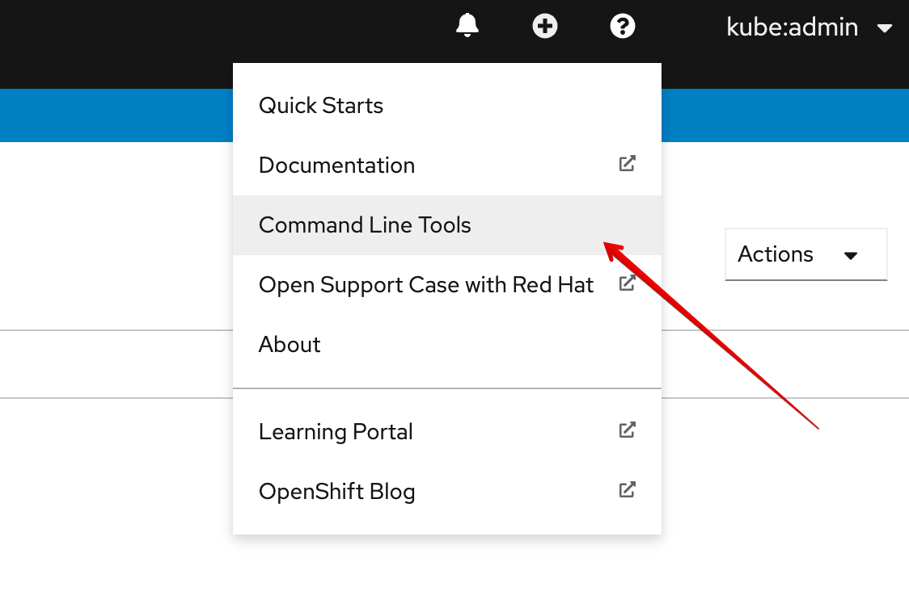
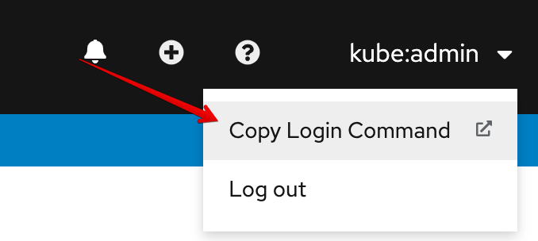
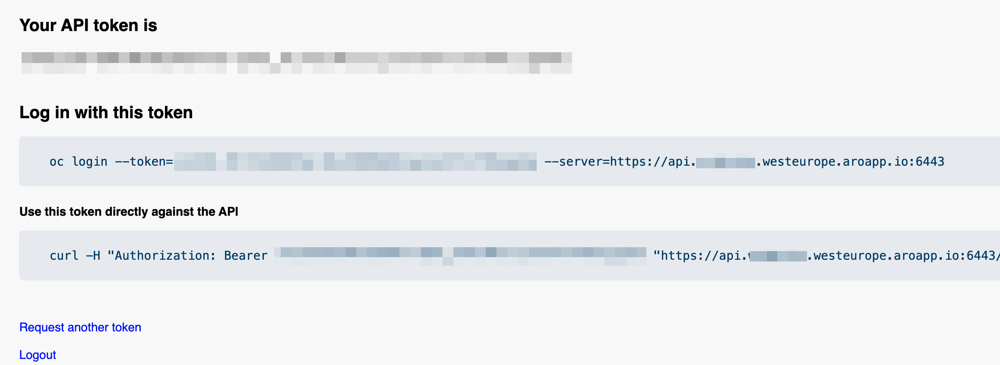

You can find here the guide:
* how to create an Azure Red Hat OpenShift 4 (ARO) cluster,
* how to setup connectivity to the new ARO cluster,
* how to deploy an example application.


The full example with all resources could be found [here](https://github.com/pajikos/iaac-aro) on GitHub.


## Create Azure Red Hat OpenShift 4 (ARO) cluster
### Prepare environment
Set the correct subsription:
```bash
az account set -s TestingSubscription
```

The file .env contains variables used in many places here to avoid typo bugs:
```bash
source .envrc
```

Create a new resource group:
```bash
az group create \
  --name $RESOURCEGROUP \
  --location $LOCATION
```

To by able to deploy ARO, these providers must be registeted:
```bash
# Register the Microsoft.RedHatOpenShift resource provider:
az provider register -n Microsoft.RedHatOpenShift --wait
# Register the Microsoft.Compute resource provider:
az provider register -n Microsoft.Compute --wait
# Register the Microsoft.Storage resource provider:
az provider register -n Microsoft.Storage --wait
# Register the Microsoft.Authorization resource provider:
az provider register -n Microsoft.Authorization --wait
```

### Networking
It will be created 2 subnets inside aro-vnet:
* master-subnet
* worker-subnet

Network Name| Network Address | Usable Host Range | Broadcast Address
--- |--- | --- | ---
aro-vnet|10.0.0.0/22|10.0.0.1 - 10.0.3.254|10.0.3.255
master-subnet|10.0.0.0/23|10.0.0.1 - 10.0.1.254|10.0.1.255
worker-subnet|10.0.2.0/23|10.0.2.1 - 10.0.3.254|10.0.3.255 

The ARO requires a special subnet for worker and master nodes, so create a new vnet first:
```bash
az network vnet create \
   --resource-group $RESOURCEGROUP \
   --name aro-vnet \
   --address-prefixes 10.0.0.0/22
```

Create subnet for master nodes:
```bash
az network vnet subnet create \
  --resource-group $RESOURCEGROUP \
  --vnet-name aro-vnet \
  --name master-subnet \
  --address-prefixes 10.0.0.0/23 \
  --service-endpoints Microsoft.ContainerRegistry
```

Create subnet for worker nodes:
```bash
az network vnet subnet create \
  --resource-group $RESOURCEGROUP \
  --vnet-name aro-vnet \
  --name worker-subnet \
  --address-prefixes 10.0.2.0/23 \
  --service-endpoints Microsoft.ContainerRegistry
```

Disable subnet private endpoint policies on the master subnet. This is required for the service to be able to connect to and manage the cluster:
```bash
az network vnet subnet update \
  --name master-subnet \
  --resource-group $RESOURCEGROUP \
  --vnet-name aro-vnet \
  --disable-private-link-service-network-policies true
```
### Setup permissions
Create a new service principal (AAD role owner reqiured):
```bash
az ad sp create-for-rbac -n "${PREFIX}arosp" --skip-assignment
```
Take appId and password and set it:
```bash
APPID="changeit"
PASSWORD="changeit"
```



More info about creating service principals: https://docs.microsoft.com/en-us/azure/aks/kubernetes-service-principal#delegate-access-to-other-azure-resources



Obtain the full registry ID and VNETID for adding roles:
```bash
ACR_REGISTRY_ID=$(az acr show --name $ACR_NAME --query id --output tsv)
VNETID=$(az network vnet show -g $RESOURCEGROUP --name aro-vnet --query id -o tsv)
```
Assign role to service principal (AAD role Owner required):
```bash
# Assign SP Permission to VNET
az role assignment create --assignee $APPID --scope $VNETID --role "Network Contributor"
# Assign SP Permission to ACR
az role assignment create --assignee $APPID --scope $ACR_REGISTRY_ID --role acrpull
```



For more info about accessing ACR with SP visit https://docs.microsoft.com/en-us/azure/container-registry/container-registry-auth-service-principal



### Creating Azure Red Hat OpenShift 4 cluster
All command before were just preparing for ARO deployment:
```bash
az aro create \
  --resource-group $RESOURCEGROUP \
  --name $CLUSTER \
  --vnet aro-vnet \
  --master-subnet master-subnet \
  --worker-subnet worker-subnet \
  --client-id $APPID \
  --client-secret $PASSWORD
```

### Image pull secrets
Kubernetes uses an image pull secret to store information needed to authenticate to your registry. To create the pull secret for an Azure container registry, you provide the service principal ID, password, and the registry URL.

Create an image pull secret with the following kubectl command:
```bash
oc create secret docker-registry acr-secret \
    --namespace test \
    --docker-server=$ACR_NAME.azurecr.io \
    --docker-username=$APPID \
    --docker-password=$PASSWORD
```



Tip for copy existing secret from another namespace to default namespace:
```bash
oc get secret acr-secret --namespace=test -o yaml | grep -v '^\s*namespace:\s' | oc apply --namespace=default -f -
```



Once you've created the image pull secret, you can use it to create Kubernetes pods and deployments. Provide the name of the secret under imagePullSecrets in the deployment file. For example:
```yaml
apiVersion: v1
kind: Pod
metadata:
  name: my-awesome-app-pod
  namespace: awesomeapps
spec:
  containers:
    - name: main-app-container
      image: sklenaracr.azurecr.io/my-awesome-app:v1
      imagePullPolicy: IfNotPresent
  imagePullSecrets:
    - name: acr-secret
```

### Securing ARO

 Create NSG and assign to aro-vnet:
```bash
# Create NSG
az network nsg create -g $RESOURCEGROUP -n "aro-nsg"
# Assing it to master-subnet
az network vnet subnet update -g $RESOURCEGROUP -n master-subnet --vnet-name aro-vnet --network-security-group "aro-nsg"
# Assign it to worker-subnet
az network vnet subnet update -g $RESOURCEGROUP -n worker-subnet --vnet-name aro-vnet --network-security-group "aro-nsg"
```

Create NSG rule for API server:
```bash
az network nsg rule create -g $RESOURCEGROUP --nsg-name "aro-nsg" -n "apiserver_in" --priority 101 \
    --source-address-prefixes "$CURRENT_IP" \
    --destination-port-ranges '6443' \
    --destination-address-prefixes "10.0.0.0/23" --access Allow \
    --description "API Server IN."
```

Setup inbound rules:
```bash
# Take ingress ip from ARO create stdout result:
#"ingressProfiles": [
#    {
#      "ip": "xxx.xxx.xxx.xxx",
#      "name": "default",
#      "visibility": "Public"
#    }
#  ],
INGRESS_IP="xxx.xxx.xxx.xxx"
#or
INGRESS_IP=$(az aro show \
    --name $CLUSTER \
    --resource-group $RESOURCEGROUP \
    --query "ingressProfiles[0].ip" -o tsv)

az network nsg rule create -g $RESOURCEGROUP --nsg-name "aro-nsg" -n "ingress-443" --priority 501 \
    --source-address-prefixes "$CURRENT_IP"  \
    --destination-port-ranges '443' \
    --destination-address-prefixes "$INGRESS_IP" --access Allow \
    --description "Ingress Allow IN."
```

Setup outbound rules (All outbound traffic is enabled by default):
```bash
# Allow ntp outbound
az network nsg rule create -g $RESOURCEGROUP --nsg-name "aro-nsg" -n "OUT-ALLOW-NTP" \
    --priority 300 --source-address-prefixes "10.0.0.0/23" "10.0.2.0/23" --destination-address-prefixes "Internet" \
    --destination-port-ranges '123' --direction Outbound --access Allow --protocol Udp --description "NTP"

# Allow https outbound
az network nsg rule create -g $RESOURCEGROUP --nsg-name "aro-nsg" -n "OUT-ALLOW-HTTPS" \
    --priority 301 --source-address-prefixes "10.0.0.0/23" "10.0.2.0/23" --destination-address-prefixes "Internet" \
    --destination-port-ranges '443' --direction Outbound --access Allow --protocol Tcp --description "HTTPS"

# Allow dns tcp outbound
az network nsg rule create -g $RESOURCEGROUP --nsg-name "aro-nsg" -n "OUT-ALLOW-DNS-TCP" \
    --priority 302 --source-address-prefixes "10.0.0.0/23" "10.0.2.0/23" --destination-address-prefixes "Internet" \
    --destination-port-ranges '53' --direction Outbound --access Allow --protocol Tcp --description "DNS TCP"

# Alow dns udp outbound
az network nsg rule create -g $RESOURCEGROUP --nsg-name "aro-nsg" -n "OUT-ALLOW-DNS-UDP" \
    --priority 303 --source-address-prefixes "10.0.0.0/23" "10.0.2.0/23" --destination-address-prefixes "Internet" \
    --destination-port-ranges '53' --direction Outbound --access Allow --protocol Udp --description "DNS Udp"

# Allow intra vnet communication
az network nsg rule create -g $RESOURCEGROUP --nsg-name "aro-nsg" -n "OUT-ALLOW-ARO-VNET" --priority 400 \
    --source-address-prefixes "10.0.0.0/23" "10.0.2.0/23" \
    --destination-port-ranges '*' --direction Outbound \
    --destination-address-prefixes "10.0.0.0/23" "10.0.2.0/23" --access Allow \
    --description "Intra vnet communication."

# Default deny all outbound traffic
az network nsg rule create -g $RESOURCEGROUP --nsg-name "aro-nsg" -n "OUT-DENY-ALL" --priority 4096 \
    --source-address-prefixes "*" \
    --destination-port-ranges '*' --direction Outbound \
    --destination-address-prefixes "*" --access Deny \
    --description "Deny outbound."
```

## Setup connectivity to ARO cluster

Set connectivity to Azure:
```bash
az login # follow instructions

# List of subscriptions
az account list -o table
# Select TestingSubscription
az account set -s TestingSubscription
```
### Access to OpenShift Web Console
```bash
source .envrc
# The simple way
az aro list-credentials \
  --name $CLUSTER \
  --resource-group $RESOURCEGROUP
```
The following example output shows what the password will be in kubeadminPassword:
```console
{
  "kubeadminPassword": "<generated password>",
  "kubeadminUsername": "kubeadmin"
}
```

You can find the cluster console URL by running the following command, which will look like this: 
https://console-openshift-console.apps.xxxxx.westeurope.aroapp.io/
```bash
az aro show \
    --name $CLUSTER \
    --resource-group $RESOURCEGROUP \
    --query "consoleProfile.url" -o tsv
```

Once you're logged into the OpenShift Web Console, click on the ? on the top right and then on Command Line Tools. Download the release appropriate to your machine.

You can download client tools here:
https://console-openshift-console.apps.xxxxx.westeurope.aroapp.io/command-line-tools

or directly from WEB Console:


### Connect with CLI Tools
Open current user profile (right upper corner) and click on "Copy Login Command":

Copy and paste login command to your console:

Test connectivity:
```bash
oc get nodes
```

## Deploying an example application

Deploying to OpenShift:
```bash
# Create namespace
oc create namespace test
# Deploy apps
oc apply -f example.yaml --namespace test
```

Setting access to deployed app:
```bash
# Retrieve your IP public address using curl
CURRENT_IP=$(curl ifconfig.me)
# Retrieve your IP public address using dig
CURRENT_IP=$(dig @resolver1.opendns.com ANY myip.opendns.com +short)
# or visit https://www.whatismyip.com/ and set manually:
CURRENT_IP="xxx.xxx.xxx.xxx"
```

```bash
# list all running services
oc get services --namespace test
# Save service IP to variable
SERVICE_IP=$(oc get svc voting-app --namespace test -o jsonpath='{.status.loadBalancer.ingress[*].ip}')

# Create a rule to enable incoming traffic from load balancer
az network nsg rule create -g $RESOURCEGROUP --nsg-name "aro-nsg" -n "IN-ALLOW-WEB" --priority 600 \
    --source-address-prefixes "$CURRENT_IP" \
    --destination-port-ranges '80' \
    --destination-address-prefixes "$SERVICE_IP" --access Allow \
    --description "Intra test application."
```
Go to:
```bash
echo http://$SERVICE_IP
```

## Resources
https://docs.microsoft.com/en-us/azure/openshift/tutorial-create-cluster