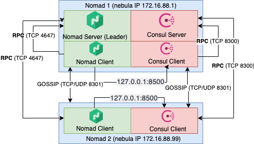
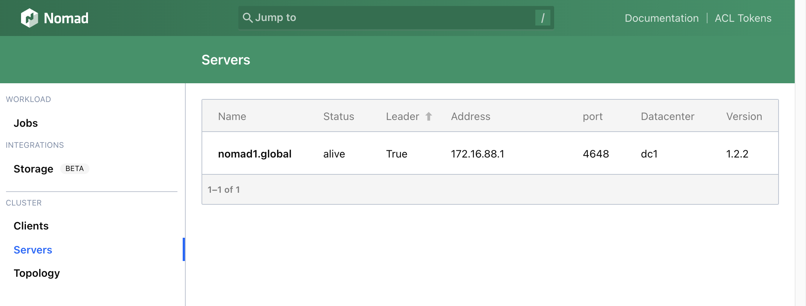
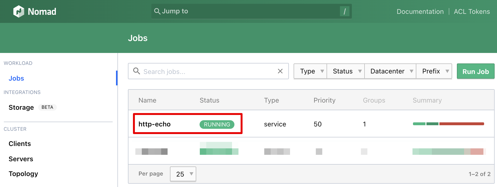
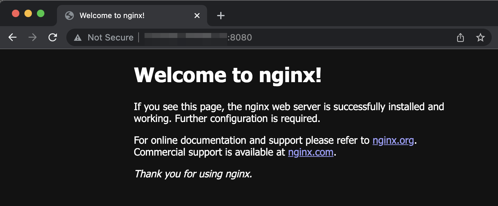
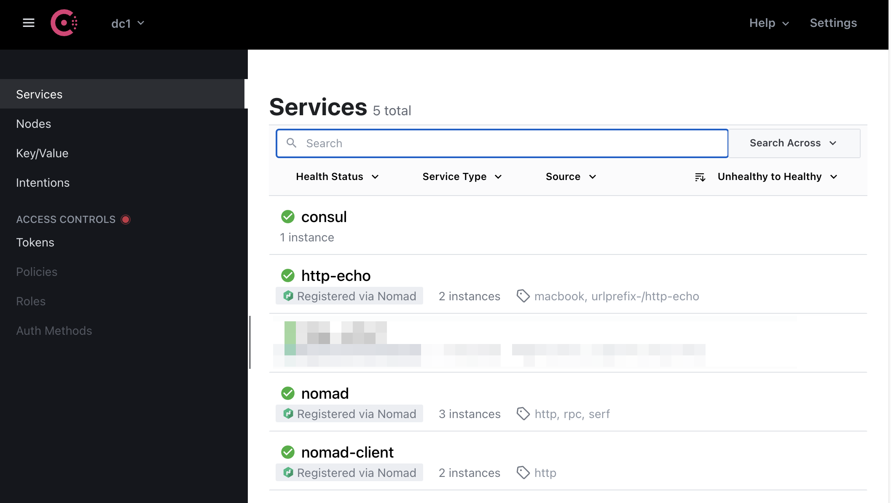
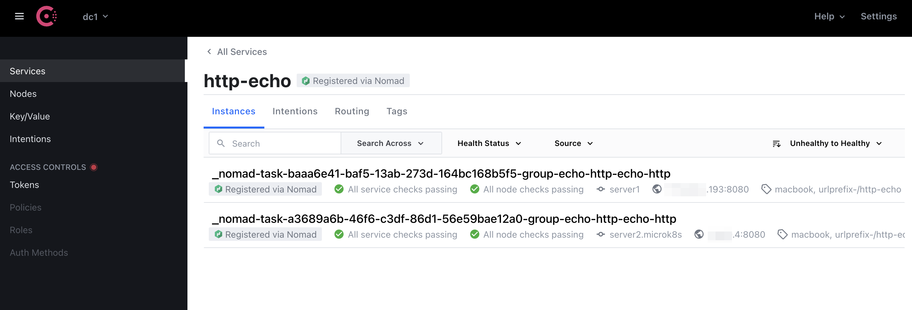

Nomad is an interesting alternative to Kubernetes. As authors of Nomad say, it is a [suplement to Kubernetes](https://www.nomadproject.io/docs/nomad-vs-kubernetes/supplement) and offers some great features.

Here you can find a guide on how to create a fresh Nomad cluster with two nodes. The first node acts as a server and client, the second node acts as a client only.
I know this architecture is [not recommended](https://github.com/hashicorp/nomad/issues/5053#issuecomment-451296159) for production purposes, but I would like to test it only.



Both nodes are not connected to the same network they are in west Europe but different cloud providers. To fulfill the connectivity requirements between nodes, I connect them to the same network using [Nebula](https://github.com/slackhq/nebula), a scalable overlay networking tool.
If all nodes are visible directly, Nebula is not necessary.


The full example with all resources could be found [here](https://github.com/pajikos/cloud-samples/tree/master/two-node-nomad-cluster) on GitHub.


## Install Nomad and other requirements
All steps in this section must be installed on all nodes.

### Install Nomad
Add the HashiCorp GPG key:
```bash
curl -fsSL https://apt.releases.hashicorp.com/gpg | sudo apt-key add -
```

Add the official HashiCorp Linux repository:

```bash
sudo apt-add-repository "deb [arch=amd64] https://apt.releases.hashicorp.com $(lsb_release -cs) main"
```

Update and install:

```bash
sudo apt-get update && sudo apt-get install nomad
```

To verify Nomad was installed correctly, try the nomad command.

```bash
nomad
```

### Install Docker Engine
I would like to test Nomad with containers, so a container runtime is required to install as well. I chose Docker, the full install manual could be found on [Docker Install Page](https://docs.docker.com/engine/install/), but quick steps are here:
Update the apt package index and install packages to allow apt to use a repository over HTTPS:
```bash
sudo apt-get update
sudo apt-get install \
    ca-certificates \
    curl \
    gnupg \
    lsb-release
```

Add Docker’s official GPG key:

```bash
curl -fsSL https://download.docker.com/linux/ubuntu/gpg | sudo gpg --dearmor -o /usr/share/keyrings/docker-archive-keyring.gpg
```

Use the following command to set up the stable repository. To add the nightly or test repository, add the word nightly or test (or both) after the word stable in the commands below. Learn about nightly and test channels.

```bash
 echo \
  "deb [arch=$(dpkg --print-architecture) signed-by=/usr/share/keyrings/docker-archive-keyring.gpg] https://download.docker.com/linux/ubuntu \
  $(lsb_release -cs) stable" | sudo tee /etc/apt/sources.list.d/docker.list > /dev/null
```

Update the apt package index, and install the latest version of Docker Engine and containerd, or go to the next step to install a specific version:

```bash
sudo apt-get update
sudo apt-get install docker-ce docker-ce-cli containerd.io
```

### Install CNI plugin 
Install CNI plugin to be able to run Docker containers in Nomad with bridge networking. More info about Docker drivers in Nomad could be found [here](https://www.nomadproject.io/docs/drivers/docker). You can choose a version depending on [your system](https://github.com/containernetworking/plugins/releases):

```bash
curl -L -o cni-plugins.tgz https://github.com/containernetworking/plugins/releases/download/v1.0.1/cni-plugins-linux-amd64-v1.0.1.tgz
sudo mkdir -p /opt/cni/bin
sudo tar -C /opt/cni/bin -xzf cni-plugins.tgz
```

## Setup Nomad
We need to configure Nomad before could be run. As I said before, nodes are connected using Nebula, so both nodes has two network interfaces, one with public IP (a default route) and one with internal private Nebula IP (preferred for intracluster communication). 

### Configure the first node
The first node has the name `nomad1` nad here is the node's Nomad configuration file content (`/etc/nomad.d/nomad.hcl`).
Full configuration options can be found at [Nomad Configuration page](https://www.nomadproject.io/docs/configuration).
```hcl

data_dir = "/opt/nomad/data"
bind_addr = "0.0.0.0"

name = "nomad1"

# Advertise on nebula1 interface only (nomad1 has more interfaces, one with public IP and one with private IP - nebula1 interface)
advertise {
  # Defaults to the first private IP address.
  http = "172.16.88.1"
  rpc  = "172.16.88.1"
  serf = "172.16.88.1"
}

# Enable server on nomad1
server {
  enabled = true
  bootstrap_expect = 1
}

# Enable client on nomad1
client {
  enabled = true
  servers = ["127.0.0.1"]
}

# Enable raw_exec driver
plugin "raw_exec" {
  config {
    enabled = true
  }
}
```

### Configure the second node
The first node has name `nomad2` nad here is node's Nomad configuration file content (`/etc/nomad.d/nomad.hcl`):
```hcl
data_dir = "/opt/nomad/data"
bind_addr = "0.0.0.0"
name = "nomad2"

# Advertise on nebula2 interface only (nomad2 has more interfaces, one with public IP and one with private IP - nebula1 interface)
advertise {
  # Defaults to the first private IP address.
  http = "172.16.88.99"
  rpc  = "172.16.88.99"
  serf = "172.16.88.99"
}

# Enable client and setup server's IP to the nomad1 IP
client {
  enabled = true
  #network_interface =
  servers = ["172.16.88.1"]
}

# Enable raw_exec Nomad driver
plugin "raw_exec" {
  config {
    enabled = true
  }
}
# Consul agent will be running locally
consul {
  address = "127.0.0.1:8500"
}
```
## Start Nomad 
Enable `nomad.service`, start it and check its status on both nodes.
```bash
sudo systemctl enable nomad.service
sudo systemctl start nomad.service
sudo systemctl status nomad.service
```

If everything works fine, you can visit Nomad Admin UI and check Client status - http://node_ip_or_hostname:4646/ui/clients:



## Run example application
I want to run nginx Docker image and listen on client's node port 8080, here is the full job example, just submit only:
```hcl
job "http-echo" {
  datacenters = ["dc1"]
  group "echo" {
    network {
      mode = "bridge" 
      port "http" {
        static = 8080
        to = 80
      }
    }
    count = 2
    task "server" {
      driver = "docker"
      config {
        image = "nginx"
        ports = ["http"]
      }
    }
  }
}
```

If everything works fine, you will see the running job in Nomad UI:


Now you can visit the Nginx page on the client's public IP and port 8080 (two instances were required, so both client nodes should listen on port 8080):


## Install Consul
Consul automates networking for simple and secure application delivery, as said by Hasicorp. I want to test an automatic service discovery when installing any job in Nomad, install and configure Consul required.

### Install Consul
Install Consul on both nodes first:
 ```bash
 sudo apt-get update && sudo apt-get install consul
 ```
#### Configure Consul on the first node (nomad1)
As the architecture diagram above shows, I want to run the Consul server and Consul agent on the same machine. This is not for production purposes and this is probably the reason why I didn't found any option how to run Consul in both modes concurrently using configuration file /etc/consul.d/consul.hcl and run as system service. So I run Cosnul from the command line, where `-dev` argument says, that's ok, run Consul as server and agent concurrently. 

```bash
# temporary solution, for testing only
sudo consul agent -dev -client 0.0.0.0 -bind 172.16.88.1 &
```

The Consul has UI as well:


 #### Configure Consul on the second node (nomad2)
The second node acts as a Consul agent only, so the standard configuration could be used:
```bash
sudo vi /etc/consul.d/consul.hcl 
```
I changed these line only (the full file content is in `resources/consul2.hcl`):
```json
bind_addr = "172.16.88.99"
retry_join = ["172.16.88.1"]
```
Enable `consul.service`, start it and check its status:
```bash
sudo systemctl enable consul.service
sudo systemctl start consul.service
sudo systemctl status consul.service
```

## Run job with service discovery
I changed my previous job as follow, see `service` section:

```hcl
job "http-echo" {
  datacenters = ["dc1"]
  group "echo" {
    network {
      mode = "bridge" 
      port "http" {
        static = 8080
        to = 80
      }
    }
    count = 2
    task "server" {
      driver = "docker"
      config {
        image = "nginx"
        ports = ["http"]
      }
    }
    service {
      name = "http-echo"
      port = "http"
  
      tags = [
        "macbook",
        "urlprefix-/http-echo",
      ]

      check {
        type     = "http"
        path     = "/"
        interval = "2s"
        timeout  = "2s"
      }
    }
  }
}
```

### Test Consul DNS service
One of the Consul features is its DNS feature. Consul resolves domain names to IP of Nomad's client IP:

```bash
dig @127.0.0.1 -p 8600 http-echo.service.consul SRV
```
and the result:
```console
; <<>> DiG 9.16.1-Ubuntu <<>> @127.0.0.1 -p 8600 http-echo.service.consul SRV
; (1 server found)
;; global options: +cmd
;; Got answer:
;; ->>HEADER<<- opcode: QUERY, status: NOERROR, id: 63772
;; flags: qr aa rd; QUERY: 1, ANSWER: 2, AUTHORITY: 0, ADDITIONAL: 5
;; WARNING: recursion requested but not available

;; OPT PSEUDOSECTION:
; EDNS: version: 0, flags:; udp: 4096
;; QUESTION SECTION:
;http-echo.service.consul.  IN  SRV

;; ANSWER SECTION:
http-echo.service.consul. 0 IN  SRV 1 1 8080 0a000004.addr.dc1.consul.
http-echo.service.consul. 0 IN  SRV 1 1 8080 adf900c1.addr.dc1.consul.

;; ADDITIONAL SECTION:
0a000004.addr.dc1.consul. 0 IN  A xxx.xxx.xxx.xxx
server2.microk8s.node.dc1.consul. 0 IN  TXT "consul-network-segment="
adf900c1.addr.dc1.consul. 0 IN  A yyy.yyy.yyy.yyy
server1.node.dc1.consul. 0  IN  TXT "consul-network-segment="
```

Our testing http-echo job is visible in Consul UI as well:


## Resources
- https://www.nomadproject.io/docs/nomad-vs-kubernetes/supplement
- https://www.nomadproject.io/docs/nomad-vs-kubernetes/alternative
- https://www.hashicorp.com/c2m
- https://www.nomadproject.io/docs/nomad-vs-kubernetes
- https://www.nomadproject.io/docs/job-specification
- https://www.nomadproject.io/docs/configuration
- https://www.consul.io/docs/discovery/dns